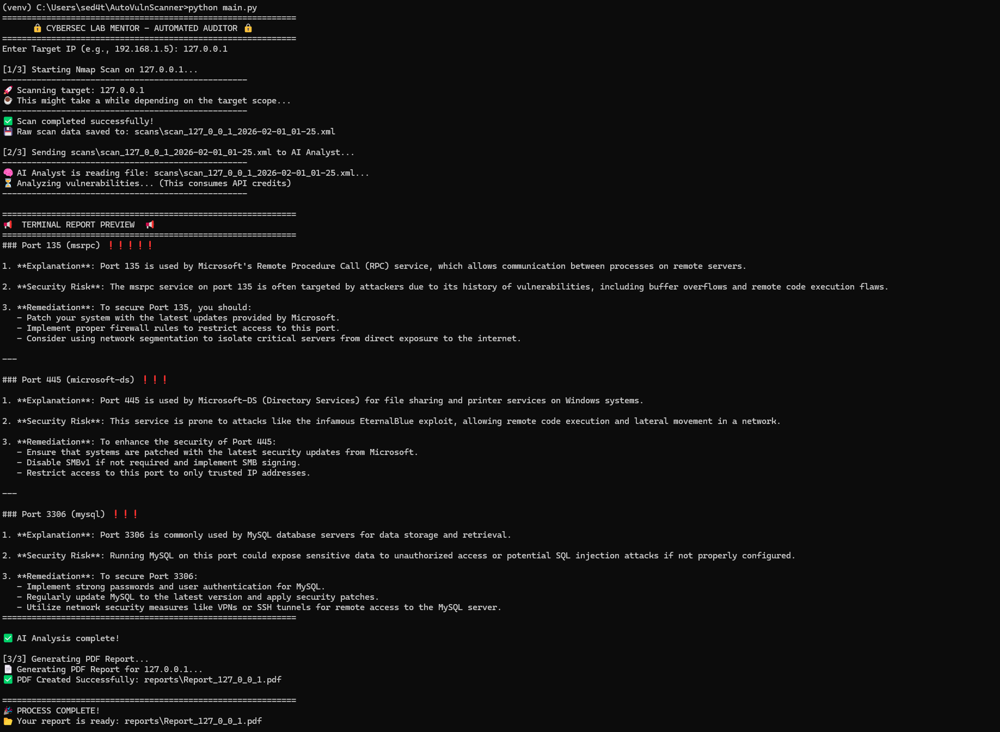

# AutoVulnScanner: AI-Powered Vulnerability Auditor

[](https://www.python.org/)
[](https://nmap.org/)
[](https://openai.com/)

**AutoVulnScanner** is an automated security assessment tool that bridges the gap between raw network scanning and actionable intelligence. It automates technical discovery via Nmap and leverages Artificial Intelligence to provide executive-level risk summaries and remediation guidance.


##Key Features
-
* **Intelligent Analysis:** Integrates with OpenAI (GPT-4/3.5) to interpret scan results and explain risks in plain English.
* **Automated Scanning:** Executes service-version detection (`-sV`) and port discovery automatically.
* **Executive Reporting:** Generates professional PDF reports ready for stakeholders.
* **Risk Prioritization:** Automatically assigns severity levels (Low to Critical) based on service exposure.

##Prerequisites
Ensure you have the following installed on your system:

Python 3.9+: Download Python

Nmap macOS: 
```brew install nmap```

Windows: Download Nmap Setup (Check "Add to PATH" during installation)

Linux: 
```sudo apt install nmap```


##Installation & Setup

- **Clone the Project:**
 ```
 git clone [https://github.com/sedat4ras/AutoVulnScanner.git](https://github.com/sedat4ras/AutoVulnScanner.git)
 cd AutoVulnScanner
```

-**Environment Isolation (Recommended)**
Create and activate a virtual environment to avoid dependency conflicts:
```
# Windows
python -m venv venv
.\venv\Scripts\activate

# macOS/Linux
python3 -m venv venv
source venv/bin/activate
```


-**Install Dependencies**
This will install all necessary libraries including python-nmap, openai, and fpdf:
```
pip install --upgrade pip
pip install -r requirements.txt
```

-**API Configuration**
Create a file named (.env) in the root directory.

Add your OpenAI API key: ```OPENAI_API_KEY=your_actual_key_here```


-**Usage Guide**

After completing the installation, you can start the automated audit process with a single command.

Start the Tool
Make sure your virtual environment is active, then run:
```
python main.py
```

-**Enter Target Information**
The tool will prompt you for a target. You can enter:

Single IP: 192.168.1.5

Localhost: 127.0.0.1 (For testing your own machine)

Domain Name: scanme.nmap.org (Nmap's authorized test server)

## Project Showcase

### Terminal Output


### Sample Output Report
The final output is a structured, executive-level PDF report. It includes technical explanations and specific remediation steps for each identified vulnerability.
-


