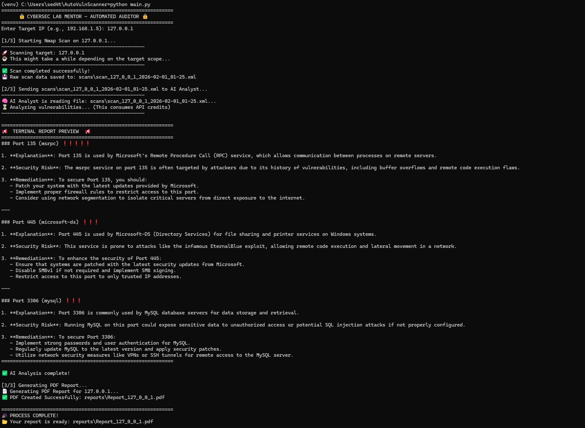

# AutoVulnScanner

> An automated security assessment tool that bridges the gap between raw Nmap scanning and actionable intelligence using AI-powered analysis and professional PDF reporting.

[](https://www.python.org/)
[](https://nmap.org/)
[](https://openai.com/)
[]()

---

## Overview

AutoVulnScanner automates the full vulnerability assessment workflow — from network discovery to executive reporting. It runs Nmap service-version detection, feeds the results to OpenAI for risk interpretation, and generates a stakeholder-ready PDF report with severity classifications and remediation guidance.

## How It Works

```
┌──────────────┐      ┌──────────────────┐      ┌─────────────────┐
│              │      │                  │      │                 │
│  Nmap Scan   │─────►│  AI Analysis     │─────►│  PDF Report     │
│  (-sV)       │      │  (GPT-4/3.5)     │      │  Generation     │
│              │      │                  │      │                 │
│ Port & Svc   │      │ Risk Assessment  │      │ Executive-Ready │
│ Discovery    │      │ Plain English    │      │ Deliverable     │
│              │      │ Remediation      │      │                 │
└──────────────┘      └──────────────────┘      └─────────────────┘
```

## Features

| Feature | Description |
|---------|-------------|
| **Automated Scanning** | Executes Nmap service-version detection (`-sV`) with automatic port discovery |
| **AI-Powered Analysis** | GPT-4/3.5 interprets scan results and explains risks in plain English |
| **Risk Prioritization** | Automatically assigns severity levels (Low to Critical) based on service exposure |
| **Executive Reporting** | Generates professional PDF reports ready for stakeholders |

## Quick Start

### Prerequisites

| Requirement | Installation |
|------------|-------------|
| Python 3.9+ | [python.org](https://www.python.org/) |
| Nmap | `brew install nmap` (macOS) / `sudo apt install nmap` (Linux) / [nmap.org](https://nmap.org/download) (Windows) |
| OpenAI API Key | [platform.openai.com](https://platform.openai.com/) |

### Installation

```bash
git clone https://github.com/sedat4ras/AutoVulnScanner.git
cd AutoVulnScanner

python -m venv venv && source venv/bin/activate  # macOS/Linux
# python -m venv venv && .\venv\Scripts\activate  # Windows

pip install -r requirements.txt
```

### Configuration

Create a `.env` file in the project root:

```
OPENAI_API_KEY=your_actual_key_here
```

### Usage

```bash
python main.py
```

Enter the target when prompted:
- **Single IP:** `192.168.1.5`
- **Localhost:** `127.0.0.1`
- **Domain:** `scanme.nmap.org` (Nmap's authorized test server)

## Project Showcase

### Terminal Output



### Sample Report

For a detailed look at the AI analysis and professional formatting, examine the [Sample PDF Report](assets/report-example.pdf) included in this repository.

## Disclaimer

This tool is intended for **authorized security assessments only**. Always obtain explicit written permission before scanning any network or system. Unauthorized scanning may violate applicable laws and regulations.

## Contact

GitHub: [sedat4ras](https://github.com/sedat4ras) | Email: sudo@sedataras.com
